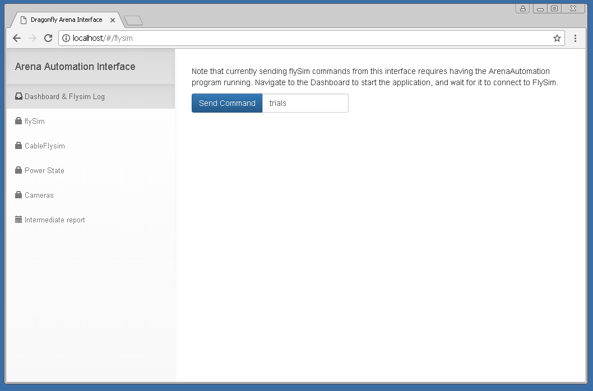

#\. Arena Automation System
This guide documents the use of the suite of
hardware and software tools that collectively
facilitate the automatic, unsupervised recording
and analysis of dragonfly activity during whole-day
recording sessions. This collection of interrelated tools
shall be referred to as the
*Arena Automation System,* or **AAS**.

For more information about how to update this documentation, read the
["About the documentation"](#About_the_documentation) section.

-------------- ---------------------------------------------------------
 **Authors**   
-------------- ---------------------------------------------------------
 Abel Corver     abel.corver [at] gmail [dot] com \           
                 _Last contribution:_ June 2017                       
-------------- ---------------------------------------------------------

<!--
##\. Table of Contents
* Practical step-by-step guide
* Technical documentation:
    * About the documentation
    * High-level overview
    * Overview of the technology stack
    * Device Diagram
    * Installation and repository structure
    * A note on code editors
    * Real-time software
        * ...
    * Real-time hardware:
        * Trigger Signal Generator
        * LED Trigger Signal Generator
        * FlySim Controller
            * FlySim Z Controller
            * Kangaroo Controller
        * Remote-controllable power switches
    * Software post-processing:
        * Overview of the processing pipeline
        * A note on data formats
        * FlySim extraction
        * Takeoff trajectory extraction
        * Telemetry extraction
    * Unfinished work-in-progress
        * Interfacing with Photrons
        * CableFlysim
        * Rotating stage
        * Networked sign
        *
    * Miscellaneous tools
        * Auto-wand tracking
        * Arena Telemetry Assessment
        * Test backpack
-->

##\. Practical step-by-step guide

###\. General setup

1. Launch the *Arena Automation Web Interface*

1. Click the following icon on the Photron PC:

    

    This will bring up a command window that will stay open,
    and can be minimized to the background:

    

1. Now open a browser (still on the Photron PC), and navigate
    to "http://localhost." (Note that depending on the network
    configuration, this same web interface can be viewed
    on other computers using the Photron PC's IP address.)

    

1. Now click on "Power" in the side menu, which opens the following page:

    

1. Click both buttons to power on the motion capture cameras,
    the Photrons, the FlySim motors, and the Telemetry --- assuming all these are connected and the power relays are
    not manually turned off. The sysem will indicate when
    the power is on:

    

###\. Cortex setup

1. Wait ~20 seconds to ensure all cameras have started. Then, on the Cortex PC, start Cortex 3.6.

    

1. Upon startup, Cortex will load the most recently used configurations. In order not to overwrite the previous calibration settings, data, etc., we re-save the setup configuration in a new directory:

    

1. As data files will be saved to the same folder as the setup file (\*.cal), we save each setup file to a new
    directory. For consistency, and to ensure automatic analysis scripts work, this directory should be created
    in the same "MoCap raw" directory as the other recordings. The convention is to name the directory
    according to the "yymmdd" (year-year-month-month-day-day) format, although this is not technically required.

    For consistency, we name the _\*.cap_ file according to the "yymmdd_precal.cap" format, to indicate the settings
    are "pre-calibration" (i.e. copied from the previous recording).

1. Connect to the cameras, then click "All On."

    

1. Turn off the arena humidifier. It will increase calibration errors. We will turn it on again after calibration.

1. Place the calibration wand in the middle of the arena.

1. Place small pieces of black cloth over the perches and LED Sync box, to ensure none of their markers are confused
for the wand, which would increase calibration errors.

1. Adjust the minimum marker size to 21:

    

1. Adjust thresholds on each camera to ensure only the 3 wand markers are seen. Make sure all (enabled) cameras
    will see at least some valid 3-marker frames, or otherwise the calibration will fail (diverge).

1. Calibrate. Be sure to cover the entire camera volume during wanding. In addition, it is a good idea to split your
    wanding procedure into three subroutines, each aligned to one of the orthogonal axes. This minimizes the colinearity
    of wand measurements, and maximizes the 3D calibration accuracy.

1. After calibration, save the current setup as "yymmdd_cal1.cap" in the same directory. For future calibrations
    throughout the day, continue the "yymmdd_calN.cap" format, where N is increased every time.

###\. Photron setup

1. On the Photron PC, start PFV:

    

1. PFV will automatically detect the connected cameras. On occasion, not all cameras are connected. If this happens
    after long use, one might have overheated and stopped responding. The solution is to have it cool down, or otherwise
    fixed if the problem persists. More frequently, however, this problem can be solved by simply repeatedly
    searching for the cameras, and ensuring they have had long enough to start up after power was turned on:

    

1. Photron receives its sync signal from the signal generator. The signal generator produces two frequencies: One
        for the Photron cameras, and one of the MAC/Mocap cameras. Be sure these frequencies are set correctly.

1. We now tell the Photrons to listen to this external clock:

    

    Then select "TRIG POS" for "TRIG TTL IN," and "ON OTHERS POS" for "SYNC IN."

    

1. Set the correct shutter value, e.g. 1000 Hz:

    

1. If we are gathering real fly trajectories, or otherwise need accurate Photron 3D reconstruction, we need to
    calibrate the Photron cameras as well.

    1. Place the L-frame in the center of the arena, and place all batteries in the battery-holder to light up the 4 LEDs.

    2. Press the record button. A window pops up. Select (and create, if it doesn't already exist) a new directory for
        this day's recordings. This directory should be in the same directory as the other Photron recording directories,
        in order for the automatic analysis scripts to find the files. Be sure to un-select "Info Save". Relevant
        settings are illustrated below:

        

    2. The "record" button will switch to "trigger in".

        

    2. Click it again. The button will display "recording" to indicate that frames are being recorded. After ~1 second, press
        "Recording Done" to stop the recording

        

    2. Switch to the "Data Save" tab, reduce the range of frames to e.g. 100, and save the file as e.g. "lframe_N.avi".

        

    2. Now remove the L-frame from the arena. Put the wand back in the arena --- the one we used to calibrate Cortex. As before,
        make sure the minimum marker size and thresholds are set correctly.

    2. Now ensure that Photron is in "Start Trigger" mode:

        

    2. Now click "Record." Once again, Photron will wait for a trigger signal:

        

    2. Now type the filename for the recorded data in cortex. After typing the name, be sure to press enter to
        finalize this name.

        

    2. Now configure the recording settings, which are specific to this wanding recording:

        

    2. Now open the arduino program.

        

    2. Then select the right serial port (currently "COM 4"):

        

    2. Now open the Serial Monitor:

        

    2. If this is the right COM port, an "h" command should identify the device as the "Teensy TTL Controller":

        

    2. Copy the "Wand200.mars" markerset file into the current Cortex directory, i.e. the one we created earlier, and
        in which our current setup file is saved. The "Wand200.mars" file can be found by searching for Wand200.mars in the
        "MoCap raw" directory.

    2. Load the "Wand200" markerset into Cortex:

        

    2. Now both Cortex and Photron are armed and listening for triggers, and the wand is in the center of the camera volume,
        and is correctly recognized by Cortex.

    2. Send a "t" command in the Serial Monitor window. This will trigger the start of both Cortex and Photron recordings.

    2. Wave the wand in the same pattern as we used to calibrate the Cortex volume. 40-60 seconds of recording should be    sufficient.

    2. Manually end both recordings by clicking the red recording button in Cortex, and clicking "recording done" in
        Photron.

1. We are now ready to arm Photron for recording. Make sure that

###\. General setup, continued

1. Now turn on the humidifier again, and remove all black pieces of cloth.

1. Now place the test yframe in the camera volume, and set the minimum marker size to 1.

1. Most likely, the thresholds will have to be tuned to prevent false marker detection.

1. Now start the *Arena Automation System* software on the Photron PC:

    

    This also brings up a command line window that can be minimized:

    

1. Now go back to the browser, and navigate to the "Log" page
    in the web interface. This page opens by default when you
    navigate to "localhost." This page will now display log
    information:

    

1. We can now navigate to the FlySim interface to send commands to FlySim:

    

1. The experiment will now run itself! Although the system is automated, it is good practice
    to check in on the system every 2 hours. This can be done remotely, minimizing the time this takes.
    Among the relatively rare system failures, common failure modes include (i) a Cortex crash,
    (ii) rare but occasional crashes in the core ArenaAutomation.exe process, and (iii) FlySim
    crashes. Crashes of either Cortex or the main ArenaAutomation.exe process will be obvious,
    indicated by the faded window and likely a Windows error dialog. A failure to present flysim trials,
    e.g. due to some occasional motor failure, will be indicated in the log window.

1. To turn the system off at night, log into the Photron PC remotely using TeamViewer, navigate to
    the power web interface as illustrated above, and click the buttons to turn off the relays. Be sure
    to actually close the ArenaAutomation.exe console window, to ensure that the data files are
    no longer being written to.

###\. post-processing

####\. Automatic post-processing

1. To commence post-processing, ...

####\. Manual post-processing of Photron 3D calibration and real prey-capture

1. To keep all key data and analysis files in a single directory, it is good practice to copy the
  *wanding_N.avi* (Photron) and *wanding_N.trc* (Cortex) files in the same output directory as the
  *.msgpack* files, which is where all other analysis files will be produced.

1. Start the "wand-tracker.bat" program.

1. Select each of the *wanding_N.avi* video files, one in each file dialog that appears. Once you've
    selected all files, click "cancel" in the next file dialog that appears. This signals to the Wand Tracker
    program to stop asking for video files.

1. Then click through the question dialogs that appear.

1. Wait for the program to digitize the wand data. You can visually monitor the performance of the wand tracker,
    both in real-time (if this option was selected), and post-hoc, using the *_postprocessed.avi* and *_tracked.avi*
    video files. Note that occasionally some points are mis-recognized. In theory this can be corrected manually
    by opening up the output of the digitization in the DLTdv program. However, in practice, this is not necessary,
    as we will remove outliers and then re-run the calibration below.

1. The wand tracking program will now have created a few *.csv* files, most importantly *wanding.xypts.csv*.

1. Now open Matlab (2014a or older)

1. Run the command "easyWand2b"

1. Set the "Wand span" to 0.2 (in meters)

1. Load an axis file. The axis is arbitrary, as we will run additional    transformations soon that will align the axis and coordinate system to Cortex. We can therefore use the same axis file each time. The file *axis_xypts_for_easywand.csv* has been created for this purpose.

1. Load the wand points.

    

1. Click "Compute calibration". This will take a while.

1. When asked whether the axis origin needs to be optimized, select "no." After the calibration finishes, click "Save results." Navigate to the same directory as all the other files for this day, and save the file under the name "wanding." This will save the DLT coefficients in "wanding_dltCoefs.csv".

    Note that the Matlab output window likely reported a very high calibration error. This is due to the imperfect automatic tracking of the wand.

1. Now exit the EasyWand window. Type "DLTdv5" in the Matlab window.

1. When asked how many cameras to process, select the correct number. Then select each camera wanding video file when prompted. *Be sure, for consistency and to prevent errors later, to select the appropriate file when asked  to "Pick movie file {N}"*. For example, select  *wanding\_\_C001H001S0001.avi* when asked for movie file 1, and *wanding\_\_C002H001S0001.avi* when asked for movie file 2.

    

1. When asked if these cameras are calibrated via DLT, choose "yes." Then select the *wanding\_dltCoefs.csv* file we just generated using easyWand2b.

1. Now click "Load Data," and select the "*wanding.xypts.csv*" file generated by the automatic wand digitizing software earlier.

    

1. Then click anywhere on one of the movie windows, and subsequently press
SHIFT-R. You should see the message "Recomputing all 3D coordinates" in the main Matlab console window.

    

1. Click "Save Data" and select the same folder as the original. In the subsequent "Data File Prefix" window, select the same file prefix as the input file, i.e. the prefix "*wanding.*". This will keep the original 2D data the same, but compute 3D residuals. When asked to overwrite existing data, select "Yes."

1. When asked to create 95% CI's, select "No."

1. Click "Quit" to exit DLTdv5

1. Now run "remove-easywand-outliers.bat". (Or execute the "remove-easywand-outliers.py" manually from the command line.)

1. In the file dialog that appears, select the XY wanding coordinate file we just (re-)saved, "*wanding.xypts.csv*".

1. This will create the file "*wanding.no_outliers.xypts.csv*", which contains the subset of XY(Z) markers with relatively low residuals.

1. Go back to Matlab, and (again) run "easyWand2b". We now repeat the steps we did before: Load the same axis file as before, change the wand span to "0.2". However, for wand points we now select the low-residual subset we just created, "*wanding.no_outliers.xypts.csv*".

1. Again click "Compute calibration." This will again take a while.

1. Again select "No" when asked whether to optimize the axis origin.

1. Notice that the wanding residuals have now drastically reduced:

    

1. Again click "Save results." When asked for a filename, type "wanding". This will again create a "*wanding_dltCoefs.csv*" file. Then close easyWand2b as before.

1. Again, type "DLTdv5" in the Matlab command prompt.

1. In the window that appears, again click "Initialize", and select the videos as before (in the right order).

1. When asked if the cameras are calibrated via DLT, again select "Yes."

1. Select the (now updated) "*wanding_dltCoefs.csv*" file.

1. Again click "Load Data" and select the "*wanding.xypts.csv*" file. (Note: Don't select the "*wanding.no_outliers.xypts.csv*" file!)

1. Again, bring focus to one of the video windows by clicking on
e.g. their title bar. Then press SHIFT-R to recompute XYZ coordinates.

1. Press "Save Data," and select the same folder our current files live in.

1. As before, select the file prefix "*wanding.*". Again, when prompted, indicate it is ok to overwrite files.

1. You will be asked if 95% confidence intervals should be computed. Again, this is not necessary for any of our analyses.

1. Quit the DLTdv5 program.

1. Before we continue, ensure that the Cortex .TRC wanding file has been copied to the same data directory we've been working in so far.

1. Now run "calibrate-photron.bat". (Or execute the "calibrate-photron.py" manually from the command line.)

1. When prompted, select the "*wanding.xyzpts.csv*" file we just created.

1. When prompted, select the "*wanding_N.trc*" we just copied to this directory.

1. When this script finishes, it will have produced a "*3dcalibration_dlt_adjustment.pickle*" file. This file contains linear regressions aligning any DLTdv5-generated XYZ coordinates with the Cortex coordinate system.

    In addition, the script will have produced various debugging plots in the "debug/3dcalibration/" subfolder.

    

    

    

    

    Although the standard deviation of the calibration appears high, on the order of 2 mm, this is accounted for by errors in detecting the true center of the wand markers in the Photron cameras. The actual calibration accuracy could be confirmed by manually annotating a 3D wand trajectory in DLTdv5, transforming it with the same calibration file, and comparing it to Cortex. Or by manually annotating smaller markers, such as the dragonfly Yframe, in addition to the real prey. Reconstructing the Yframe will give a good measure of actual cross-camera calibration accuracy.

1. TODO

##\. Technical documentation
###\. About the documentation
The documentation is written in Pandoc-flavored Markdown. A good reference on this flavor
of Markdown can be found **[here](http://rmarkdown.rstudio.com/authoring_pandoc_markdown.html)**.

###\. High-level overview
The _Arena Automation System_ consists of roughly two
components. A real-time pipeline, and an offline post-processing
pipeline. The real-time system has three main goals:

####\. The realtime pipeline
* **Goal 1: Save all motion capture data**.

The real-time system
receives every single 3D marker point, and saves its XYZ
coordinates. The output file contains all these markers
(*.msgpack files) is the most important reference dataset,
from which all analysis scripts start.

In addition, the real-time system continuously interfaces
with the Cortex software, and triggers the recording of
virtually all raw mocap data. Because these blocks have
to be re-triggered, about .5 seconds of data is lost for
every minute of recording. However, because the XYZ
marker data (as opposed to the raw XY camera centroids)
is streamed independently, no XYZ data is lost.

* **Goal 2: Trigger high-speed cameras and telemetry**

High-speed (Photron) recordings cannot be performed
continuously, and therefore need to be triggered.
Similarly, the telemetry data recording is currently
recorded upon being triggered, and not continuously saved.

The *Arena Automation System* continuously streams
motion capture data from the Cortex software in real-time,
and tracks the identified Yframes. Upon detection of
a takeoff event (currently based on a velocity threshold),
the system sends a USB command to the Trigger Signal Generator,
which phase-locks the trigger with the motion capture and
camera clocks. This trigger signal will save all high-speed
and telemetry data, and furthermore causes the LED Trigger
Signal to blink, creating an identifiable trigger alignment
point in the motion capture data stream.

* **Goal 3: Control real-time systems**

Lastly, the real-time component of the *Arena Automation System*
interfaces with various peripheral devices that require
real-time feedback and are integral to the experiment.

A primary example of this is the Perch Controller. The
*AAS* monitors the orientation of the perches, and sends
serial commands to the Perch Controller which then rotates
the perches.

In addition, the *AAS* monitors whether a dragonfly is
currently on the perch and has reached the desired
orientation. If so, it notifies the FlySim Controller
that the dragonfly is ready. This functionality, if
enabled, can be used to limit trial presentation to only
those circumstances when the dragonfly is correctly
oriented.

Other real-time monitoring functions can be added
easily.

####\. The offline pipeline

The goal of the offline pipeline is to extract all
dragonfly activity, especially prey-capture flights,
from the mass of data collected by the real-time system.

The offline pipeline consists of many scripts (written in
Python) that each extract a particular type of information
from the raw recordings. Here is an overview:

| Tables                | Are                     | Cool    |
| ------------- |:-------------:| -----:|
| col 3 is            | right-aligned | $1600 |
| col 2 is            | centered            |     $12 |
| zebra stripes | are neat            |        $1 |

Each of these scripts can be run independently,
facilitating easier experimentation with new
analyses, and allowing subsets of the analysis to be
updated without re-running the whole pipeline.

In most cases, however, the pipeline will be run
with a single click. The main script that will
start the processing will then run each of the processing
sub-steps. All analysis output files will be put
in the data directory for that day/recording, with the
exception of the summary reports, which are in their
own folder.

The offline pipeline takes as its starting point the
XYZ marker data files produced by the real-time system.
These files have .msgpack extensions.

Unless this step is disabled, the first step in the
postprocessing pipeline is to merge all data files
recorded on the same day, under the assumption that
a given day will only contain a single type of
experiment.

The next step is to assign to each frame a unique ID.
Because Cortex can be stopped and restarted,
the frame counter can be reset to 0. This step
makes sure that in all later analyses, frameIDs
are unique and consistent across different type of
analysis output files.

At the end of the entire pipeline, a few files are of
particular interest:

* *.mocap.csv* : ...

...

###\. Hardware Subsystems

###\. Software processing
This section details the various scripts that
extract content from

####\. Overview of the processing pipeline

Cortex frame received, streamed to file

Cortex frame re-indexed to prevent index conflicts
