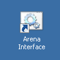
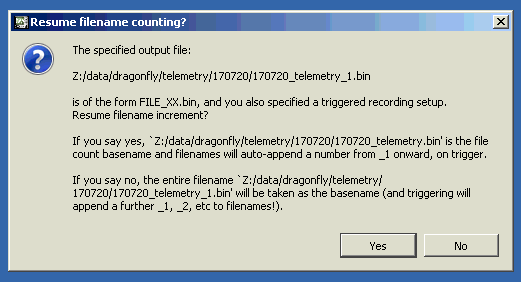
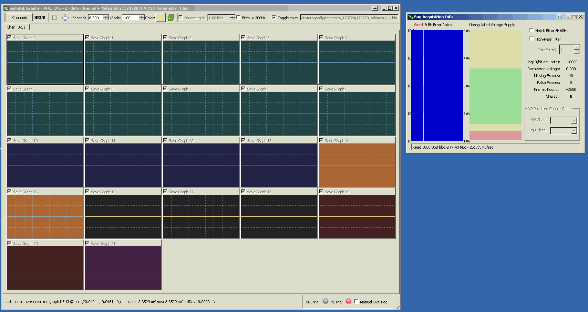
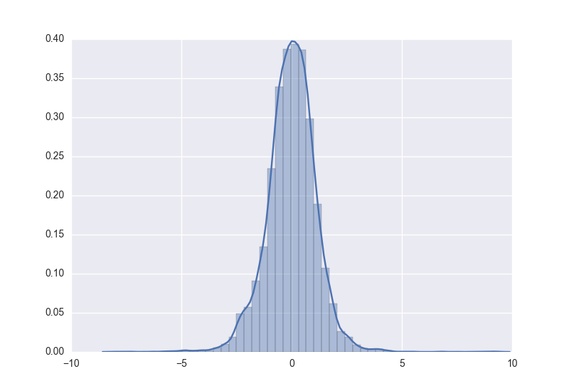

#\. Arena Automation System
This guide documents the use of the suite of
hardware and software tools that collectively
facilitate the automatic, unsupervised recording
and analysis of dragonfly activity during whole-day
recording sessions. This collection of interrelated tools
shall be referred to as the
*Arena Automation System,* or **AAS**.

For more information about how to update this documentation, read the
["About the documentation"](#About_the_documentation) section.

-------------- ---------------------------------------------------------
 **Authors**   
-------------- ---------------------------------------------------------
 Abel Corver     abel.corver [at] gmail [dot] com \           
                 _Last contribution:_ June 2017                       
-------------- ---------------------------------------------------------

##\. Practical step-by-step guide

###\. General setup

1. Launch the *Arena Automation Web Interface*

    **Note:** Due to a small bug, the Arena Automation Web Interface will occasionally crash after running for an extended amount of time. This does not interfere with any ongoing experiments or software, and can be fixed by simply restarting the Arena Automation Web Interface, as described here. This bug is being investigated.

1. Click the following icon on the Photron PC:

    

    This will bring up a command window that will stay open,
    and can be minimized to the background:

    

1. Now open a browser (still on the Photron PC), and navigate
    to "http://localhost." (Note that depending on the network
    configuration, this same web interface can be viewed
    on other computers using the Photron PC's IP address.)

    

1. Now click on "Power" in the side menu, which opens the following page:

    

1. Click both buttons to power on the motion capture cameras,
    the Photrons, the FlySim motors, and the Telemetry --- assuming all these are connected and the power relays are
    not manually turned off. The sysem will indicate when
    the power is on:

    

###\. Cortex setup

1. Wait ~20 seconds to ensure all cameras have started. Then, on the Cortex PC, start Cortex 3.6.

    

1. Upon startup, Cortex will load the most recently used configurations. In order not to overwrite the previous calibration settings, data, etc., we re-save the setup configuration in a new directory:

    

1. As data files will be saved to the same folder as the setup file (\*.cal), we save each setup file to a new
    directory. For consistency, and to ensure automatic analysis scripts work, this directory should be created
    in the same "MoCap raw" directory as the other recordings. The convention is to name the directory
    according to the "yymmdd" (year-year-month-month-day-day) format, although this is not technically required.

    For consistency, we name the _\*.cap_ file according to the "yymmdd_precal.cap" format, to indicate the settings
    are "pre-calibration" (i.e. copied from the previous recording).

1. Connect to the cameras, then click "All On."

    

1. Turn off the arena humidifier. It will increase calibration errors. We will turn it on again after calibration.

1. Place the calibration wand in the middle of the arena.

1. Place small pieces of black cloth over the perches and LED Sync box, to ensure none of their markers are confused
for the wand, which would increase calibration errors.

1. Adjust the minimum marker size to 21:

    

1. Adjust thresholds on each camera to ensure only the 3 wand markers are seen. Make sure all (enabled) cameras
    will see at least some valid 3-marker frames, or otherwise the calibration will fail (diverge).

1. Calibrate. Be sure to cover the entire camera volume during wanding. In addition, it is a good idea to split your
    wanding procedure into three subroutines, each aligned to one of the orthogonal axes. This minimizes the colinearity
    of wand measurements, and maximizes the 3D calibration accuracy.

1. After calibration, save the current setup as "yymmdd_cal1.cap" in the same directory. For future calibrations
    throughout the day, continue the "yymmdd_calN.cap" format, where N is increased every time.

###\. Photron setup

1. On the Photron PC, start PFV:

    

1. PFV will automatically detect the connected cameras. On occasion, not all cameras are connected. If this happens
    after long use, one might have overheated and stopped responding. The solution is to have it cool down, or otherwise
    fixed if the problem persists. More frequently, however, this problem can be solved by simply repeatedly
    searching for the cameras, and ensuring they have had long enough to start up after power was turned on:

    

1. Photron receives its sync signal from the signal generator. The signal generator produces two frequencies: One
        for the Photron cameras, and one of the MAC/Mocap cameras. Be sure these frequencies are set correctly.

1. We now tell the Photrons to listen to this external clock:

    

    Then select "TRIG POS" for "TRIG TTL IN," and "ON OTHERS POS" for "SYNC IN."

    

1. Set the correct shutter value, e.g. 1000 Hz:

    

1. If we are gathering real fly trajectories, or otherwise need accurate Photron 3D reconstruction, we need to
    calibrate the Photron cameras as well.

    1. If L-frame recording is required, do the following. **Note:** This is currently not required, and the same Lframe dataset can be re-used. A secondary registration transformation will align the Cortex and Photron coordinate systems, thus overriding the L-frame.

        2. Place the L-frame in the center of the arena, and place all batteries in the battery-holder to light up the 4 LEDs.

        2. Press the record button. A window pops up. Select (and create, if it doesn't already exist) a new directory for
            this day's recordings. This directory should be in the same directory as the other Photron recording directories,
            in order for the automatic analysis scripts to find the files. Be sure to un-select "Info Save". Relevant
            settings are illustrated below:

            

        2. The "record" button will switch to "trigger in".

            

        2. Click it again. The button will display "recording" to indicate that frames are being recorded. After ~1 second, press
            "Recording Done" to stop the recording

            

        2. Switch to the "Data Save" tab, reduce the range of frames to e.g. 100, and save the file as e.g. "lframe_N.avi".

            

        2. Now remove the L-frame from the arena. Put the wand back in the arena --- the one we used to calibrate Cortex. As before,
            make sure the minimum marker size and thresholds are set correctly.

    2. Now ensure that Photron is in "Start Trigger" mode:

        

    2. Now click "Record." Once again, Photron will wait for a trigger signal:

        

    2. Now type the filename for the recorded data in cortex. After typing the name, be sure to press enter to
        finalize this name.

        

    2. Now configure the recording settings, which are specific to this wanding recording:

        

    2. Now open the arduino program.

        

    2. Then select the right serial port (currently "COM 4"):

        

    2. Now open the Serial Monitor:

        

    2. If this is the right COM port, an "h" command should identify the device as the "Teensy TTL Controller":

        

    2. Copy the "Wand200.mars" markerset file into the current Cortex directory, i.e. the one we created earlier, and
        in which our current setup file is saved. The "Wand200.mars" file can be found by searching for Wand200.mars in the
        "MoCap raw" directory.

    2. Load the "Wand200" markerset into Cortex:

        

    2. Now both Cortex and Photron are armed and listening for triggers, and the wand is in the center of the camera volume,
        and is correctly recognized by Cortex.

    2. Send a "t" command in the Serial Monitor window. This will trigger the start of both Cortex and Photron recordings.

    2. Wave the wand in the same pattern as we used to calibrate the Cortex volume. 40-60 seconds of recording should be    sufficient.

    2. Manually end both recordings by clicking the red recording button in Cortex, and clicking "recording done" in PFV.

1. We are now ready to arm Photron for recording.

###\. SpikeGL setup

1. If Telemetry data needs to be acquired, SpikeGL should be started as well.

1. Currently two versions of SpikeGL are available.

    - **2016 version**: C:/Users/leonardo/Desktop/SpikeGL_StimGL_64Bit_Qt5/

    - **Most Recent version**: Z:/people/Abel/SpikeGL/release

1. The 2016 version is currently most stable, but does not save sufficient data to accurately reconstruct the timing of those telemetry data frames arriving before the hardware TTL trigger.

1. The most recent version does save the relevant data, and should be used in the future.

    **Note**: Currently a (presumably minor) bug is causing a slowdown of the SpikeGL software, leading to delayed saving of data, making the program difficult to use. This bug is being actively investigated at the moment and this notice will be updated as soon as the fix is made.

1. To start SpikeGL, run the relevant "SpikeGL.exe" executable in one of the above directories.

    

1. In the window that appears, press "b", or click "New Bug Acquisition" in the "File" menu.

    

1. Ignore "AO Device Invalid" notifications.

    

1. Configure the Telemetry Acquisition.

    2. In particular, click "Browse" to choose an appropriate filename. For consistency, create a new directory in the "year-year-month-month-day-day" format, and select "year-year-month-month-day-day_telemetry_1.bin" as the filename.

    2. Ensure the correct TTL line inputs are selected for recording, and that the right TTL input is selected as the trigger. The current trigger input (TTL 4) is currently selected by default.

    2. Select the right prepend/append duration that will be recorded around the TTL center trigger.

    2. Select the sampling rate.

    2. Click "OK"

    

  1. Select "Yes" when asked to "Resume filename counting."

    

  1. Two SpikeGL windows will now appear. No data will be displayed, as the Transceiver power has not yet been turned on.

    

  1. Before turning on the Telemetry Transceiver, **ensure that the antenna is connected to the Transceiver!** If the Transceiver is turned on without a connected antenna, this can in principle seriously harm the device.

  1. Ensure there are no significant metal objects in the antenna volume. Although small metal parts are ok, especially when farther removed from the antenna, large metal sheets can in theory reflect power back into the Transceiver and negatively affect its long-term performance.

  1. Now turn on the Transceiver power. If a backpack is in range, data should start appearing in both data graph windows.

  1. Every time a trigger is received, a new triplet of files (.bin, .meta and .bug3) will be written to the chosen data directory.

###\. Flysim setup

1. Open a Serial command interface to the FlySim controller.

1. Send an "h" command the confirm this is indeed the FlySim controller.

1. Send the command "z 400" to raise FlySim to a height of ~400 mm.

    **Note**: Due a small bug, it appears that sometimes the FlySim Controller doesn't respond to Z commands unless a "position" command is first sent directly to the FlySim Z controller. Only one such command seems to fix the error. This bug should be fixed soon. More info below on how to interface with the FlySim Z controller.

1. Now send the command "tune." Within a few seconds, you should see the motors will start to shoot the artificial bead back and forth.

1. Wait approximately 60 seconds for the tuning sequence to complete.

1. Now manually, or using the power interface explained above, power down the device.

1. After a few seconds, power the device back on. This power cycling is required by the Kangaroo motor driver that controls the X axis, and ensures the newly calibrated settings are written to and loaded from memory.

1. The next FlySim commands are best sent through the Arena Automation Web Interface.

1. Be sure to close the Arduino IDE instance associated with this Serial Interface, or otherwise be sure to close the Serial command window and interface. This ensures that _ArenaAutomation.exe_ can establish a connection with the FlySim controller.

1. After the Arduino IDE serial interface is closed, and _ArenaAutomation.exe_ has been started as described below, FlySim commands can be sent using the Arena Automation Web Interface, again as described below.

###\. General setup, continued

1. Now turn on the humidifier again, and remove all black pieces of cloth.

1. Now place the test yframe in the camera volume, and set the minimum marker size to 1.

1. Most likely, the thresholds will have to be tuned to prevent false marker detection.

1. Now start the *Arena Automation System* software on the Photron PC:

    

    This also brings up a command line window that can be minimized:

    

1. Now go back to the browser, and navigate to the "Log" page
    in the web interface. This page opens by default when you
    navigate to "localhost." This page will now display log
    information:

    

1. We can now navigate to the FlySim interface to send commands to FlySim:

    

1. The experiment will now run itself! Although the system is automated, it is good practice
    to check in on the system every 2 hours. This can be done remotely, minimizing the time this takes.
    Among the relatively rare system failures, common failure modes include (i) a Cortex crash,
    (ii) rare but occasional crashes in the core ArenaAutomation.exe process, and (iii) FlySim
    crashes. Crashes of either Cortex or the main ArenaAutomation.exe process will be obvious,
    indicated by the faded window and likely a Windows error dialog. A failure to present flysim trials,
    e.g. due to some occasional motor failure, will be indicated in the log window.

1. To turn the system off at night, log into the Photron PC remotely using TeamViewer, navigate to
    the power web interface as illustrated above, and click the buttons to turn off the relays. Be sure
    to actually close the ArenaAutomation.exe console window, to ensure that the data files are
    no longer being written to.

###\. post-processing

####\. Automatic, single-click post-processing

1. To commence post-processing, navigate to the "*arena-automation*" directory, and click the "*.bat*" file "*auto-update-analysis.bat*".

1. This will merge recording fragments taken on a given day into a single directory and data file for each day.

1. It will subsequently do the following:

    2. **Correct frame indices:** This ensures that each
        Mocap frame has a unique frame ID. Duplicate indexes are created when Cortex is restarted, either as a result of clicking the start/stop recording button, or by closing and re-opening the Cortex program.

    2. **Extract raw (.vc) camera data**: The raw cameras data is gathered from data files in the Cortex data directory. The raw camera data is then indexed by *uncorrected* frameID and timestamp, and is then matched to the *corrected* frameIDs above.

        The Cortex data is then integrated into a new "*.msgpack*" data file (with the new extension "*.raw.msgpack*"), that now contains both XYZ and raw XY camera data. The Arena Automation System contains a utility script (util.py) to easily browse this raw data.

    2. **Extract mocap (LED) triggers**: The system then searches for a signal from the LED Sync Box, and saves recognized triggers to file.

        By default, the search system will only search for LED Sync signals that occur close in time to the trigger timestamps saved by the core *ArenaAutomation.exe* program in the real time log file.

        However, the script can be easily switched to searching for triggers in all files, though this will take a few hours for an all-day recording.

    2. **Extract real-time log**: The "*ArenaAutomation.exe*" software write a log file during its real-time processing. This log file contains such things as detected takeoffs, any hardware triggers sent, presented trials, state of internal buffers, etc. During extraction, this log is converted from an internal SQL database format to a plain text file. In addition, the FlySim trials log output is parsed, and a "*.trials.csv*" file is produced with statistics on e.g. height and velocity of presented trials.

    2. **Extract FlySim trajectories**: The system then searches for FlySim trajectories. The key signature of a FlySim trajectory is a series of markers (unidentified by Cortex) that are contiguous in space and time. The system currently further checks for linearity, but this condition can be removed if in the future non-linear trajectories are used.

    2. **Extract takeoffs / perching locations**: The system then searches for Yframe trajectories, in particular those that are preceded by a few (currently at least 2) seconds of perching. This way, we can quickly distinguish between trajectories that merely correspond to a dragonfly flying through the volume, versus those where a dragonfly actually pursued a prey.

        Conversely, the system saves those datapoints at which the dragonfly was sitting still, prior to takeoff. This can be used to plot heatmaps of preferred perching locations, etc.

    2. **Extract telemetry**: The system then searches for telemetry files (in the default telemetry data directory) corresponding to the mocap data in the "*.msgpack*" master file. This correspondence is based on timestamp.

        The relevant "*.meta*", "*.bin*", and "*.bug3*" files are post-processed into a single, trigger-aligned table.

        Subsequently, the system searches for matches between the mocap (LED) triggers, and the telemetry triggers, based on system clock timestamps. When a match is found, the telemetry and mocap data are time-aligned into a single table, and this table is saved as a "*.csv*" file. This file will likely form the basis of most analyses, and represents the key output of the entire automation system.

    2. **Extract high-speed video**: Subsequently, the system will look for high-speed video files that occurred at the same time as the mocap trigger (again based on system clock timestamps), and merges the filename of the corresponding high-speed video file into the "*.csv*" output of the telemetry extraction step.

        _**At this point, the most important analyses are essentially done!**_   

    2. **Generate reports**: Subsequently, the system will generate HTML reports that interactively present the detected takeoff (and FlySim) trajectories. This allows quick debugging of the processing pipeline, and gives one a sense of what happened in the arena.

        In addition, the reports include heatmaps of perching locations, and statistics about the types of FlySim trials that were presented.

        The HTML report system is highly extensible, and different types of plots can be added in the future.

    2. **Extract markersets**: Independently of the other scripts, the system will also output a "\*.csv" file containing the XYZ locations of various markers, as well as the corresponding markerset name. This allows easy plotting of e.g. Yframe trajectories in e.g. Matlab. Note that all this information is contained in the "*.msgpack*" files, and this "\*.csv" file is therefore redundant.

#####\. The final output data files

Relevant data files can be found in the following directories:

1. **Behavior video data directory**: Z:/data/dragonfly/behavior video/< date >/
1. **Telemetry data directory**: Z:/data/dragonfly/telemetry/< date >/
1. **Main data directory**: Z:/people/Abel/arena-automation/data/< date >/

At the end of all post-processing, you will (or can, if the relevant script was executed) encounter the following files in the main data directory:

* **< date >.msgpack**: The original data file
* **< date >.log**: The original log file

* **< date >.msgpack.index**: The index file that is always created when any script accesses the .msgpack files. The index facilitates randomly accessing frame by frame index and timestamp.

* **< date >.takeoffs.csv**: This file contains the frame ranges of the putative takeoff events.
* **< date >.tracking.csv**: This file is associated with the _.takeoffs.csv_ file, and contains XYZ marker data for the takeoff events in question.

* **< date >.mocap.csv**: This file contains only those trajectories deemed to be genuine takeoff trajectories of interest --- based on the span of the trajectory, and the duration of perching just prior to takeoff. It is essentially a subset of _.tracking.csv_. It includes all three vertices of the Yframe, as well as FlySim data.
* **< date >.mocap.all.csv**: This file contains all the data in _.mocap.csv_, but also includes all other unidentified XYZ markers.

* **< date >.perches.csv**: This file is the dual of _.takeoffs.csv_, and contains stretches of continuous perching.

* **< date >.perch_objects.csv**: This file contains locations of the recognized perch object markersets. This file is not used much anymore, but can be used to easily plot the locations of the perches.

* **< date >.flysim.csv**: This file is generated by the FlySim trajectory detection script. It contains frame ranges of putative FlySim trajectory events.
* **< date >.flysim.tracking.csv**: This file is associated with the _.flysim.csv_ file, and contains XYZ marker data for the flysim trajectories in question.

* **< date >.log.txt**: This file contains the same information as _\*.log_ files, but in plain text format.
* **< date >.trials.csv**: This file is extracted from the _*.log_ files, and contains statistics on FlySim trajectory delay, height, velocity and velocity speedup, as reported by FlySim.

* **vc.sqlite**: Temporary file containing all raw (\*.vc) camera data gathered by Cortex. This file can be deleted.
* **< date >.raw.msgpack**: Contains the same data as the .msgpack file, as well as the \*.vc data in "vc.sqlite".
* **< date >.raw.msgpack.index**: An index file for the \*.raw file.

* **< date >\_N.telemetry.csv**: These files contain the processed telemetry data. They can be regenerated from the .bin/.meta/.bug3 files in the telemetry data directories, and can therefore be deleted if the memory space they take up is an issue. Because they represent binary data in text format, their memory footprint is necessarily larger than the original raw binary files. However, they make telemetry analysis significantly easier.

####\. Automatic post-processing of individual output types

In addition to running all these post-processing steps automatically, each step can be run independently. This is useful when updating or debugging scripts, as it allows quickly re-running a script without needing to re-run all others.

The easiest way to debug and run individual files is using the IDE. See the section "Debugging and Running the Python Code."

####\. Manual post-processing of Photron 3D calibration and real prey-capture

1. To keep all key data and analysis files in a single directory, it is good practice to copy the
  *wanding_N.avi* (Photron) and *wanding_N.trc* (Cortex) files in the same output directory as the
  *.msgpack* files, which is where all other analysis files will be produced.

1. Start the "wand-tracker.bat" program.

1. Select each of the *wanding_N.avi* video files, one in each file dialog that appears. Once you've
    selected all files, click "cancel" in the next file dialog that appears. This signals to the Wand Tracker
    program to stop asking for video files.

1. Then click through the question dialogs that appear.

1. Wait for the program to digitize the wand data. You can visually monitor the performance of the wand tracker,
    both in real-time (if this option was selected), and post-hoc, using the *_postprocessed.avi* and *_tracked.avi*
    video files. Note that occasionally some points are mis-recognized. In theory this can be corrected manually
    by opening up the output of the digitization in the DLTdv program. However, in practice, this is not necessary,
    as we will remove outliers and then re-run the calibration below.

1. The wand tracking program will now have created a few *.csv* files, most importantly *wanding.xypts.csv*.

1. Now open Matlab (2014a or older)

1. Run the command "easyWand2b"

1. Set the "Wand span" to 0.2 (in meters)

1. Load an axis file. The axis is arbitrary, as we will run additional    transformations soon that will align the axis and coordinate system to Cortex. We can therefore use the same axis file each time. The file *axis_xypts_for_easywand.csv* has been created for this purpose.

1. Load the wand points.

    

1. Click "Compute calibration". This will take a while.

1. When asked whether the axis origin needs to be optimized, select "no." After the calibration finishes, click "Save results." Navigate to the same directory as all the other files for this day, and save the file under the name "wanding." This will save the DLT coefficients in "wanding_dltCoefs.csv".

    Note that the Matlab output window likely reported a very high calibration error. This is due to the imperfect automatic tracking of the wand.

1. Now exit the EasyWand window. Type "DLTdv5" in the Matlab window.

1. When asked how many cameras to process, select the correct number. Then select each camera wanding video file when prompted. *Be sure, for consistency and to prevent errors later, to select the appropriate file when asked  to "Pick movie file {N}"*. For example, select  *wanding\_\_C001H001S0001.avi* when asked for movie file 1, and *wanding\_\_C002H001S0001.avi* when asked for movie file 2.

    

1. When asked if these cameras are calibrated via DLT, choose "yes." Then select the *wanding\_dltCoefs.csv* file we just generated using easyWand2b.

1. Now click "Load Data," and select the "*wanding.xypts.csv*" file generated by the automatic wand digitizing software earlier.

    

1. Then click anywhere on one of the movie windows, and subsequently press
SHIFT-R. You should see the message "Recomputing all 3D coordinates" in the main Matlab console window.

    

1. Click "Save Data" and select the same folder as the original. In the subsequent "Data File Prefix" window, select the same file prefix as the input file, i.e. the prefix "*wanding.*". This will keep the original 2D data the same, but compute 3D residuals. When asked to overwrite existing data, select "Yes."

1. When asked to create 95% CI's, select "No."

1. Click "Quit" to exit DLTdv5

1. Now run "remove-easywand-outliers.bat". (Or execute the "remove-easywand-outliers.py" manually from the command line.)

1. In the file dialog that appears, select the XY wanding coordinate file we just (re-)saved, "*wanding.xypts.csv*".

1. This will create the file "*wanding.no_outliers.xypts.csv*", which contains the subset of XY(Z) markers with relatively low residuals.

1. Go back to Matlab, and (again) run "easyWand2b". We now repeat the steps we did before: Load the same axis file as before, change the wand span to "0.2". However, for wand points we now select the low-residual subset we just created, "*wanding.no_outliers.xypts.csv*".

1. Again click "Compute calibration." This will again take a while.

1. Again select "No" when asked whether to optimize the axis origin.

1. Notice that the wanding residuals have now drastically reduced:

    

1. Again click "Save results." When asked for a filename, type "wanding". This will again create a "*wanding_dltCoefs.csv*" file. Then close easyWand2b as before.

1. Again, type "DLTdv5" in the Matlab command prompt.

1. In the window that appears, again click "Initialize", and select the videos as before (in the right order).

1. When asked if the cameras are calibrated via DLT, again select "Yes."

1. Select the (now updated) "*wanding_dltCoefs.csv*" file.

1. Again click "Load Data" and select the "*wanding.xypts.csv*" file. (Note: Don't select the "*wanding.no_outliers.xypts.csv*" file!)

1. Again, bring focus to one of the video windows by clicking on
e.g. their title bar. Then press SHIFT-R to recompute XYZ coordinates.

1. Press "Save Data," and select the same folder our current files live in.

1. As before, select the file prefix "*wanding.*". Again, when prompted, indicate it is ok to overwrite files.

1. You will be asked if 95% confidence intervals should be computed. Again, this is not necessary for any of our analyses.

1. Quit the DLTdv5 program.

1. Before we continue, ensure that the Cortex .TRC wanding file has been copied to the same data directory we've been working in so far.

1. Now run "calibrate-photron.bat". (Or execute the "calibrate-photron.py" manually from the command line.)

1. When prompted, select the "*wanding.xyzpts.csv*" file we just created.

1. When prompted, select the "*wanding_N.trc*" we just copied to this directory.

1. When this script finishes, it will have produced a "*3dcalibration_dlt_adjustment.pickle*" file. This file contains linear regressions aligning any DLTdv5-generated XYZ coordinates with the Cortex coordinate system.

    In addition, the script will have produced various debugging plots in the "debug/3dcalibration/" subfolder.

    

    

    

    

    Although the standard deviation of the calibration appears high, on the order of 2 mm, this is accounted for by errors in detecting the true center of the wand markers in the Photron cameras. The actual calibration accuracy could be confirmed by manually annotating a 3D wand trajectory in DLTdv5, transforming it with the same calibration file, and comparing it to Cortex. Or by manually annotating smaller markers, such as the dragonfly Yframe, in addition to the real prey. Reconstructing the Yframe will give a good measure of actual cross-camera calibration accuracy.

1. TODO

##\. Technical documentation
###\. About the documentation
The documentation is written in Pandoc-flavored Markdown. A good reference on this flavor
of Markdown can be found **[here](http://rmarkdown.rstudio.com/authoring_pandoc_markdown.html)**.

###\. Hardware wiring diagram

###\. High-level overview
The _Arena Automation System_ consists of roughly two
components. A real-time pipeline, and an offline post-processing
pipeline. The real-time system has three main goals:

####\. The realtime pipeline
* **Goal 1: Save all motion capture data**.

The real-time system
receives every single 3D marker point, and saves its XYZ
coordinates. The output file contains all these markers
(*.msgpack files) is the most important reference dataset,
from which all analysis scripts start.

In addition, the real-time system continuously interfaces
with the Cortex software, and triggers the recording of
virtually all raw mocap data. Because these blocks have
to be re-triggered, about .5 seconds of data is lost for
every minute of recording. However, because the XYZ
marker data (as opposed to the raw XY camera centroids)
is streamed independently, no XYZ data is lost.

* **Goal 2: Trigger high-speed cameras and telemetry**

High-speed (Photron) recordings cannot be performed
continuously, and therefore need to be triggered.
Similarly, the telemetry data recording is currently
recorded upon being triggered, and not continuously saved.

The *Arena Automation System* continuously streams
motion capture data from the Cortex software in real-time,
and tracks the identified Yframes. Upon detection of
a takeoff event (currently based on a velocity threshold),
the system sends a USB command to the Trigger Signal Generator,
which phase-locks the trigger with the motion capture and
camera clocks. This trigger signal will save all high-speed
and telemetry data, and furthermore causes the LED Trigger
Signal to blink, creating an identifiable trigger alignment
point in the motion capture data stream.

* **Goal 3: Control real-time systems**

Lastly, the real-time component of the *Arena Automation System*
interfaces with various peripheral devices that require
real-time feedback and are integral to the experiment.

A primary example of this is the Perch Controller. The
*AAS* monitors the orientation of the perches, and sends
serial commands to the Perch Controller which then rotates
the perches.

In addition, the *AAS* monitors whether a dragonfly is
currently on the perch and has reached the desired
orientation. If so, it notifies the FlySim Controller
that the dragonfly is ready. This functionality, if
enabled, can be used to limit trial presentation to only
those circumstances when the dragonfly is correctly
oriented.

Other real-time monitoring functions can be added
easily.

####\. The offline pipeline

The goal of the offline pipeline is to extract all
dragonfly activity, especially prey-capture flights,
from the mass of data collected by the real-time system.

The offline pipeline consists of many scripts (written in
Python) that each extract a particular type of information
from the raw recordings. Each of these scripts can be run independently, facilitating easier experimentation with new analyses, and allowing subsets of the analysis to be updated without re-running the whole pipeline.

In most cases, however, the pipeline will be run
with a single click. The main script that will
start the processing will then run each of the processing
sub-steps. All analysis output files will be put
in the data directory for that day/recording, with the
exception of the summary reports, which are in their
own folder.

The offline pipeline takes as its starting point the
XYZ marker data files produced by the real-time system.
These files have .msgpack extensions.

Unless this step is disabled, the first step in the
postprocessing pipeline is to merge all data files
recorded on the same day, under the assumption that
a given day will only contain a single type of
experiment.

###\. Overview of the technology stack

The technology stack was chosen based on the requirements of each Arena Automation subsystem.

####\. The real-time pipeline
The real-time pipeline ("*ArenaAutomation.exe*") is written entirely in **C/C++**. This facilitates rapid processing.

####\. The real-time web interface
The real-time web interface is mostly just an HTML front end for the API that the real-time C/C++ software exposes. The web interface Graphical User Interface (GUI) is written in HTML/Javascript. The web backend in also written in Javascript, and runs on NodeJS.

####\. The post-processing pipeline
All postprocessing scripts --- with some minor exceptions, see below --- are written in **Python 3.5**. Note that Python 2.7 and 3.5 are not compatible, and therefore future additions to the Python software have to be written in Python 3.x as well.

In addition to the Python post-processing pipeline, several debugging scripts can be found in the form of **Jupyter Notebooks**. These notebooks contain Python code. _Jupyter Notebooks are the recommended way of debugging and interacting with the Arena Automation postprocessing pipeline, as they can directly call the utility libraries._

The exceptions, not written in Python, are:

* The Photron 3D calibration code is written in Matlab.

* Some debugging scripts, which were occasionally used for quickly inspecting output files, were written in R. These scripts are in no way required by the processing pipeline, but have been kept in a few directories in case their basic content proves useful in the future.

###\. Debugging and Running the Python Code

The Integrated Development Environment (IDE) used to develop the post-processing (Python) pipeline is the PyCharm IDE (see below). This IDE is the best way to familiarize yourself with the different Python postprocessing scripts, as well as run, debug and edit individual scripts.

###\. Hardware Subsystems

This section documents the capabilities of each hardware interface. In the case of Arduino-compatible interfaces, it details the available commands that are available using the Serial interface.

####\. Opening a serial interface

1. Open the "Arduino IDE"

    

1. Open serial (/COM) port 6. **Note:** The COM port might be different than 6. We will see soon how to verify whether we selected the right port.

    

    Newline settings should be set to "Newline," and the baud rate to 9600 for the devices below, unless otherwise noted.

1. Open the Serial Monitor (CTRL-SHIFT-M)

    

1. In the serial monitor window that appears, type "h" followed by ENTER.

1. The output will indicate what device has been connected to.

####\. Arduino interfaces

Each Arduino interface is programmed according to a similar framework, which facilitates modularizing available commands, and extending them later. The available commands are listed below.

#####\. FlySim Controller

1. Connect to the FlySim controller as outlined in the section "Opening a serial interface." (Current COM Port: 6)

1. The following commands are available:

    2. **h**: Send a string identifying this controller

    2. **z**: Send the FlySim line to a particular height (calibrated to mm). The height should be correct to within a few millimeters. If more accuracy is required, acceptable error limits should be changed in the code, and calibration values should be tuned.

        **Note**: Due a small bug, it appears that sometimes the FlySim Controller doesn't respond to Z commands unless a "position" command is first sent directly to the FlySim Z controller. Only one such command seems to fix the error. This bug should be fixed soon. More info below on how to interface with the FlySim Z controller.

    2. **tune**: Auto-tune the X bead. This command should be run once every day, or every few days. For the full tuning sequence, see the practical guide above.

    2. TODO

    2. TODO

#####\. Rotating perch Controller

1. Connect to the Rotating Perch controller as outlined in the section "Opening a serial interface." (Current COM Port: ?)

#####\. TTL Trigger Controller

1. Connect to the TTL Trigger controller as outlined in the section "Opening a serial interface." (Current COM Port: 4)

#####\. Power Controller (1 \& 2)

1. Connect to the Power controller as outlined in the section "Opening a serial interface." (Current COM Port: ?)

#####\. LED Sync Controller

1. Connect to the LED Sync controller as outlined in the section "Opening a serial interface." (Current COM Port: ?)

#####\. FlySim Z Controller

1. Connect to the FlySim Z controller as outlined in the section "Opening a serial interface." (Current COM Port: ?)

##\. Future directions

1. **Facilitate manually processing selective frame ranges in Cortex.**: Given that Cortex data files are automatically saved, it is possible to process any events that occur directly in Cortex. There are two approaches:

    - For every takeoff event, include the Cortex filename (_".cap"_) and frame range of the event. The user can then manually open the relevant file and navigate to the correct framerange.

    - For every trajectory, create a new Cortex file with just the relevant framerange.

    Although the second option is preferable, the first one will be easier to implement and a good first solution.

1. **Fix SpikeGL bug**: As mentioned above, currently a bug causes delays with SpikeGL triggering... This bug is being investigated right now.

1. **Directly interface with Photron cameras**: The arena-automation repository contains working code to save Photron videos directly from the _ArenaAutomation.exe_ program. This has the advantage of separating Photron _triggering_ from _saving_. This way, a hardware TTL trigger can still immediately (e.g. center-) trigger the Photron cameras, but the decision whether to save the video can be made based on more data about the actual trajectory, and how likely it is to be interesting...

    - To-do: Check how pre-/post-trigger time window is currently set, and how it can be changed.
    - To-do: Check and modify the logic evaluating whether the trajectory is interesting

1. ... work in progress ...
